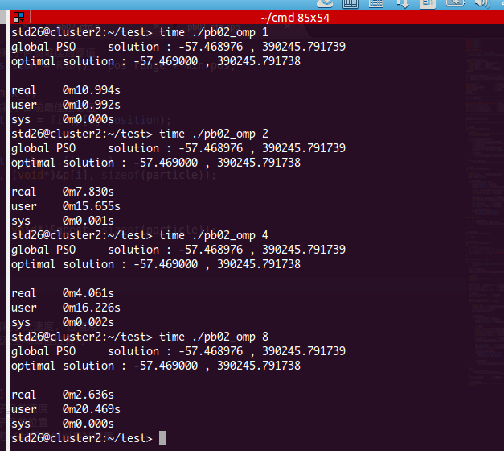
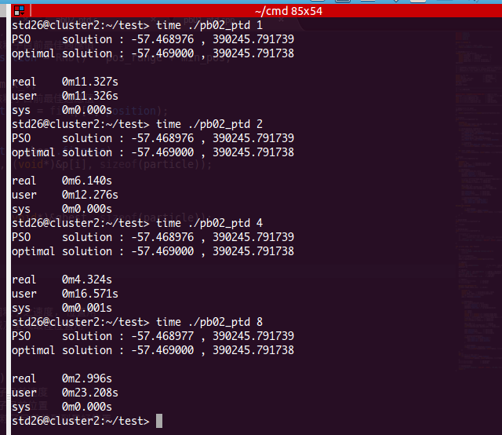

# HW4

## openmp

申明 lbest[thread_num] 數組存儲每個線程的 local best 粒子。避免多個線程競爭 gbest。

1000000次迭代外層用 omp parallel for 包起來。最後更新 gbest 爲 lbest[] 中最佳粒子。

主要修改部分如下，在 `mian` 函數中刪除 `ParticleMove` 函數，避免函數調用帶來的開銷而直接使用下面代碼。

```c
    #pragma omp parallel for
    for(j=0; j<max_itera; j++)   // 進行迭代
    {
        unsigned i;
        double v, pos;     // 暫存每個粒子之速度, 位置用
        double ppos, gpos; // 暫存區域及全域最佳位置用
        int id = omp_get_thread_num();
        gpos = lbest[id].position;
        
        // 更新速度與位置
        for(i=0; i<particle_cnt; i++){
            v = p[i].velocity; // 粒子目前速度
            pos=p[i].position; // 粒子目前位置
            ppos=p[i].pbest_pos; // 粒子目前曾到到最好位置

            int seed1;
            int seed2;
            double r1 = (double)rand_r(&seed1)/RAND_MAX;
            double r2 = (double)rand_r(&seed2)/RAND_MAX;
            v = w*v + c1*r1*(ppos-pos) + c2*r2*(gpos-pos); // 更新速度
            if(v<-max_v) v=-max_v;    // 限制最大速度
            else if(v>max_v) v=max_v; // 限制最大速度

            pos = pos + v;               // 更新位置
            if(pos>max_pos) pos=max_pos; // 限制最大位置
            else if(pos<min_pos) pos=min_pos; // 限制最小位置

            p[i].velocity= v;        // 更新粒子速度      
            p[i].position=pos;       // 更新粒子位置
            p[i].fitness = fit(pos); // 更新粒子適應值

            // 更新該粒子目前找過之最佳值
            if(p[i].fitness > p[i].pbest_fit) {
                p[i].pbest_fit = p[i].fitness ;
                p[i].pbest_pos = p[i].position;
            }

            // 更新全域最佳值
            if(p[i].fitness > lbest[id].fitness) 
                memcpy((void*)&lbest[id], (void*)&p[i], sizeof(particle));
        }
    }
    int i;
    for (i = 0; i < num; i++) {
        if (lbest[i].fitness > gbest.fitness)
            memcpy((void*)&gbest, (void*)&lbest[i], sizeof(particle));
    }
```

結果如下圖：



加速效果明顯，且線程數越多，加速效果越佳。

## pthread

同 openmp 一樣，申明 lbest[thread_num] 數組存儲每個線程的 local best 粒子。避免多個線程競爭 gbest。

然後在將 particle* p;  申明爲全局變數，在 `mian` 函數中對每個線程 `pthread_create(&thread_p[i], NULL, threadPraticle, (void*)i);`

主要代碼如下所示：

```c
void *threadPraticle(void *rank) {
    long threadId = (long) rank;
    long dist = 1000000/thread_num;

    long my_first_x1 = threadId * dist;
    long my_last_x1 = my_first_x1 + dist;
    long j;

    for(j=my_first_x1; j<my_last_x1; j++)   // 進行迭代
    {
        unsigned i;
        double v, pos;     // 暫存每個粒子之速度, 位置用
        double ppos, gpos; // 暫存區域及全域最佳位置用
        gpos = lbest[threadId].position;
        

        // 更新速度與位置
        for(i=0; i<particle_cnt; i++){
            v = p[i].velocity; // 粒子目前速度
            pos=p[i].position; // 粒子目前位置
            ppos=p[i].pbest_pos; // 粒子目前曾到到最好位置

            int seed1;
            int seed2;
            double r1 = (double)rand_r(&seed1)/RAND_MAX;
            double r2 = (double)rand_r(&seed2)/RAND_MAX;
            v = w*v + c1*r1*(ppos-pos) + c2*r2*(gpos-pos); // 更新速度
            if(v<-max_v) v=-max_v;    // 限制最大速度
            else if(v>max_v) v=max_v; // 限制最大速度

            pos = pos + v;               // 更新位置
            if(pos>max_pos) pos=max_pos; // 限制最大位置
            else if(pos<min_pos) pos=min_pos; // 限制最小位置

            p[i].velocity= v;        // 更新粒子速度      
            p[i].position=pos;       // 更新粒子位置
            p[i].fitness = fit(pos); // 更新粒子適應值

            // 更新該粒子目前找過之最佳值
            if(p[i].fitness > p[i].pbest_fit) {
                p[i].pbest_fit = p[i].fitness ;
                p[i].pbest_pos = p[i].position;
            }

            // 更新全域最佳值
            if(p[i].fitness > lbest[threadId].fitness) 
                memcpy((void*)&lbest[threadId], (void*)&p[i], sizeof(particle));
        }
    }
    return NULL;
}
```



同樣的，加速效果明顯，且線程數越多，加速效果越佳。
