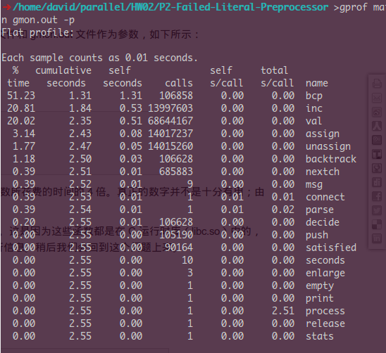

# HW2

## Task-01

`ccntpsieve.c`平行化方法：

1. 申明全局变量 num_thd 从命令行获取线程数；
2. 动态初始化全局变量 sieve 为长度 n+1 的数组；
3. 使用多线程，将 2：n 分区块，指派给 num_thd 个线程
4. 注册线程函数，各个线程在各自区块内异步完成对 sieve 数组的标记。

**注意！需要做好数组区块的对线程id的分配**

核心函数平行化实现：

```c
void *primecount(void * rank) {
      int threadid = (long) rank;
      int m, t;
      int step = (n - 2)/num_thd;
      int my_first_i = 2 + threadid * step;
      int my_last_i;
      if (threadid == num_thd - 1)
          my_last_i = my_first_i + step + (n - 2)%num_thd + 1;
      else 
          my_last_i = my_first_i + step;
  
      for (m = my_first_i; m < my_last_i; m++) 
          for (t = 2 * m; t <= n; t += m)
              sieve[t] = 1;                                                  
      return NULL;
}
```

由于只能在遍历一遍 sieve 数组后，才能进行，sum计数，所以sum计算放在mian，效率不高。
下面以100000000为输入进行计时。


num_thd    |    time
--------------- | ----------
1                 | 106.02
2                 | 61.704
4                 | 60.209
8                 | 62.612
12               | 63.038
16               | 60.596

## Task 02

平行化方法与task 01 基本一致，即将sieve 数组的标记工作交给`thread gruop`去完成，求和放到线程函数外面主函数`main`中完成。

核心函数平行化实现：

```c
void *primecount(void * rank) {                                           
      int threadid = (long) rank;
      int m, t;
          
      int step = (n - 2)/num_thd;
      int my_first_i = 2 + threadid * step;
      int my_last_i;
      if (threadid == num_thd - 1)
          my_last_i = my_first_i + step + (n - 2)%num_thd + 1;
      else
          my_last_i = my_first_i + step;
  
      for (m = my_first_i; m < my_last_i; m++)
          for (t = 2 * m; t <= n; t += m)
              set(sieve, t);
      return NULL;
  }
```

下面以300000000为输入，测试函数性能。

num_thd    |    time
--------------- | ----------
1                 | 72.323
2                 | 71.523
4                 | 72.492
8                 | 72.523
12               | 72.369
16               | 73.117

结论：两个任务的多线程版本都没有原版本快，主要问题可能在与，标记与求和分开，造成了额外计算的开销。


## Task 03

### 分析

使用gprof 工具剖析程序的运行热点。



* 分析`bcp`函数，发现主要是完成对每个`lit`所出现的`clauses`进行处理

* 由于`lit`所在的行已经预先以`linked list`的形式处理到`occs`中，`linked list`以 -1值为结尾。

于是，我采用`omp`优化`travel linked list`的方式，对`bcp`进行优化。

### 优化

拆开原来的`for (p = lit2occs[lit]; (clsidx = *p) >= 0; p++)` 遍历`linked list`，改成使用`while (*p >= 0)`进行遍历，遍历操作作为一个`single task`交由每个单一的线程去计算。

代码主要修改如下：

```c
static int bcp (void)
{
    int lit, * p, clsidx, failed, count, other, * q, tmp;

    failed = 0;
    while (!failed && next_to_propagate < top_of_trail)
    {   
        lit = -*next_to_propagate++;
        LOG (msg ("propagate %d", -lit));
        propagations++;
#pragma omp single
        {   
            p = lit2occs[lit];
            while (*p >= 0)
            {   
#pragma omp task firstprivate(p) shared(nonfalse, clauses, failed)
                {   
                    clsidx = *p; 
                    count = nonfalse[clsidx];                                  
                    assert (count > 0); 
                    count--;
                    nonfalse[clsidx] = count;
                    if (!count)
                    {   
                        if (!failed)
                        {   
FOUND_CONFLICTING_CLAUSE:
                            failed = 1;
                            LOG (msg ("conflicting clause %d", clsidx));
                        }   
                    }   
                    else if (!failed && count == 1)
                    {   
                        tmp = 0;
                        for (q = clauses[clsidx]; (other = *q); q++)
                        {   
                            tmp = val (other);
                            if (tmp >= 0)
                                break;
                        }   
                        if (!other)
                            goto FOUND_CONFLICTING_CLAUSE;
                        if (tmp <= 0)
                            /*    continue;*/
                            /*LOG (msg ("implying %d by clause %d", other, clsidx));*/
                            assign (other);
                    }   
                }   
                p++;
            }   
        } 
    }                                                                          

    return !failed;
}
```

### 结果

执行命令：`$ ./sflprepc -p num inputfile outputfile`

以`schup-l2s-guid-1-k56.dimacs`为输入，测试优化性能。

num_thd    |    time
--------------- | ----------
1                 | 5m34.753s
2                 | 5m36.105s
4                 | 5m46.691s
8                 | 5m36.479s
12               | 5m47.995s
16               | 5m31.176s

结果并没有多少性能上的提升，原因可能是，性能的瓶颈并不在`linked list`的遍历上面，即使如此`omp`对遍历的平行化效果也不是太佳。

然而由于时间紧迫，来不及重写整个文件。